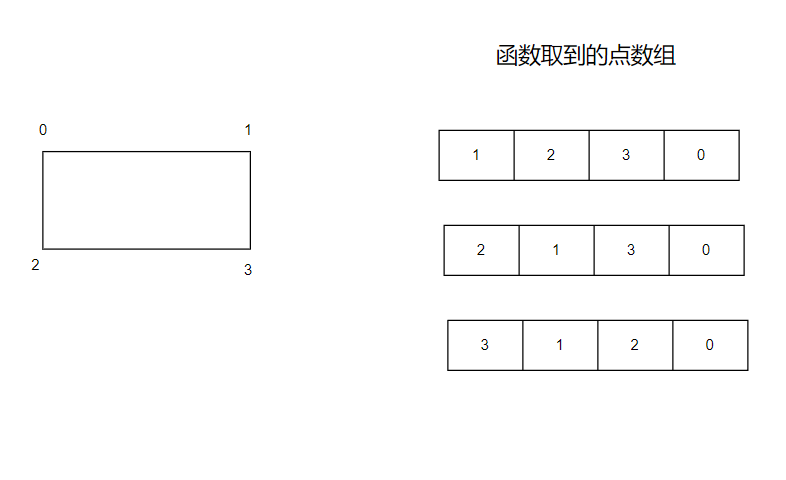
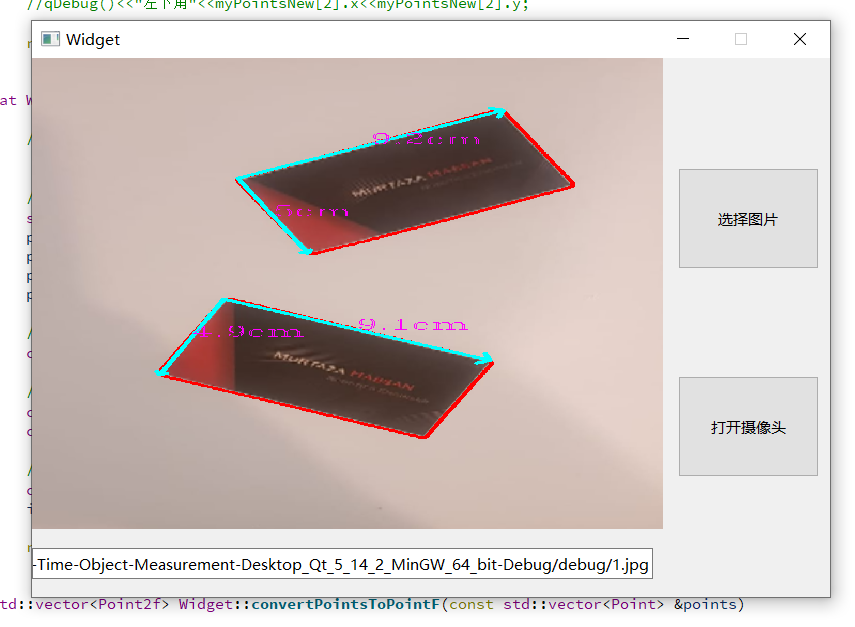
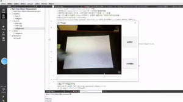

# 实时物品测量

取自小破站[2022油管超火的【OpenCV项目】使用OpenCV实时测量物体的尺寸——附源码素材_人工智能|计算机视觉|OpenCV实战|图像处理_哔哩哔哩_bilibili](https://www.bilibili.com/video/BV1oi4y1m7zw/?spm_id_from=333.880.my_history.page.click&vd_source=c4944999c53797b4cdb92aa59ce9afb2) 作者是用py+opencv3+numpy实现，我用

qt + cpp+opencv452实现了其功能，还添加了摄像头实时检测，不过这个功能还没做到丝滑，有点卡顿，目前还做不到视频里识别那么丝滑（太菜了）

## 项目环境

- qt 5.14.2/cpp11 STL
- opencv452

## 项目细节

这个功能具体是这么实现的：

### 第一 预处理

灰度处理、GaussianBlur(高斯模糊)，然后进行Canny边缘检测，再dilate(膨胀)3次，erode(腐蚀)2次，来放大轮廓；

### 第二 寻找A4纸轮廓

调用findContours函数，寻找比较大的四方形轮廓，取最大的那个轮廓为背景；

### 第三 重排轮廓点及透视变换

我们取的轮廓是一个Vector<point2f>数组，里面存在四个点，但是是无序的，我们并不知道顺序,如下图，点数组可以下面三个任何一个，我们需要重排点，使其得到顺序，我重排的顺序为左上，右上，左下，右下，其在数组中序号分别为0、1、2、3；怎么重排呢，也很简单，opencv里坐标系原点在左上角，x轴向右延伸，y轴向下延伸，那么可以得到，xy坐标之和最大者序号为3，最小者为0，xy坐标之差最大者为1，最小者为2.

透视变换，简单来说，就是有这么一副图像，它的拍摄视角不是从正面拍摄的，而是带有一定的角度，我们希望能得到从正面观察的视角。A4纸的尺寸为210*297，所以变换后的尺寸就是这个尺寸的四个点，利用getPerspectiveTransform，输入为重排后的点数组，以及A4纸标准尺寸（0,0）、（210，0）、（0,297）、（210,297）数组，得到变换矩阵，再调用warpPerspective

函数变换，并稍微修剪一下图像，就可以得到A4纸背景

### 第四 检测A4纸中的卡片并绘制尺寸

对步骤三种处理过的图像在进行查找轮廓，重排序点，找到卡片的轮廓，并计算其尺寸，A4纸的作用就相当于标尺，给程序一个基准算出卡片的尺寸；

# 项目运行效果

